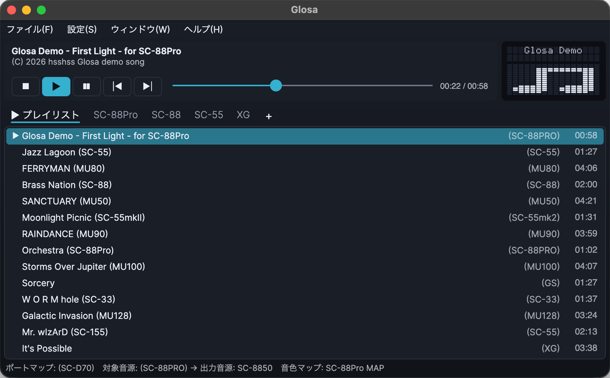
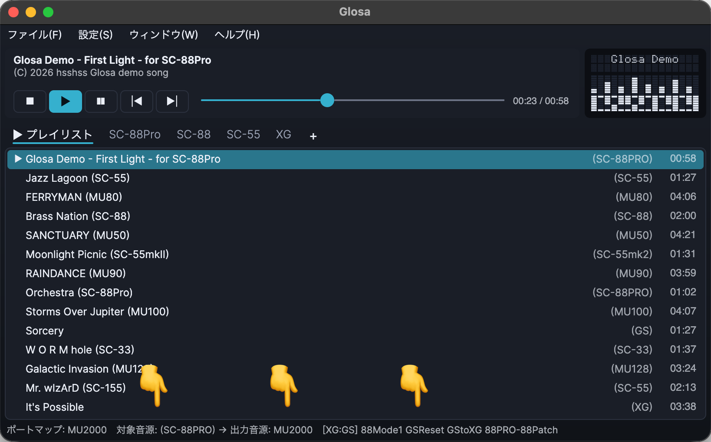
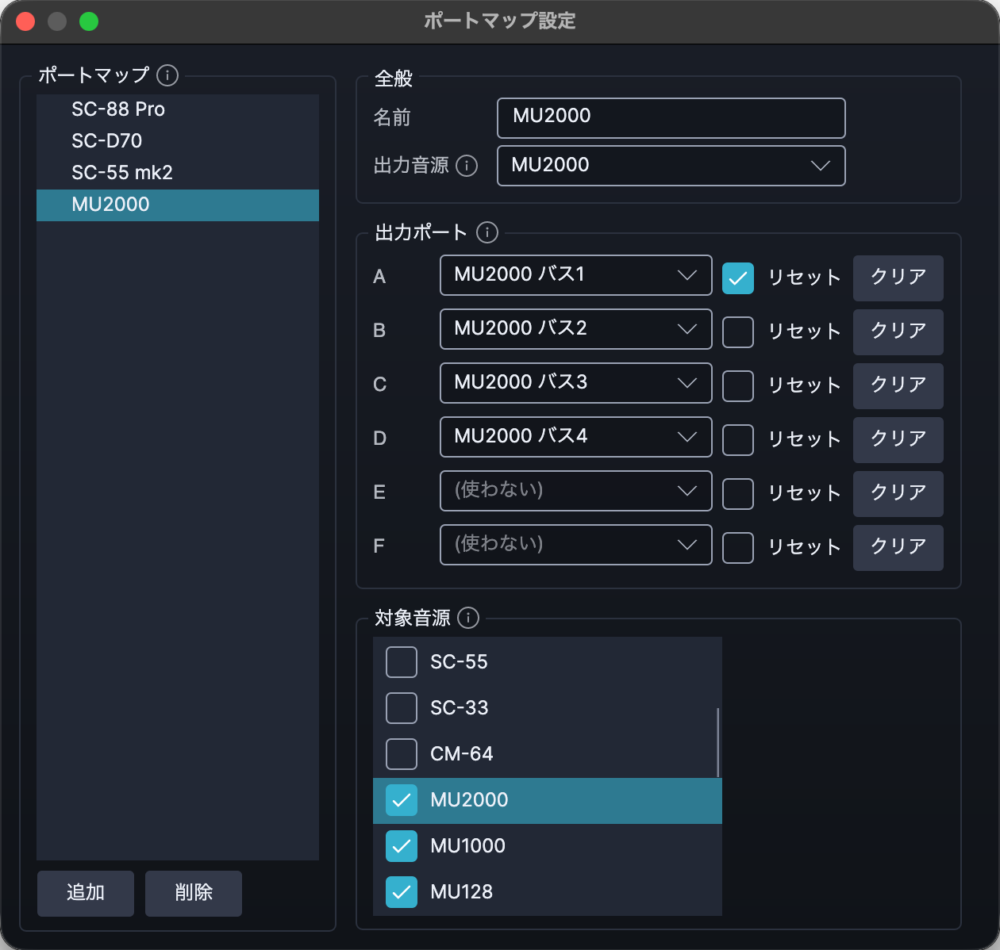
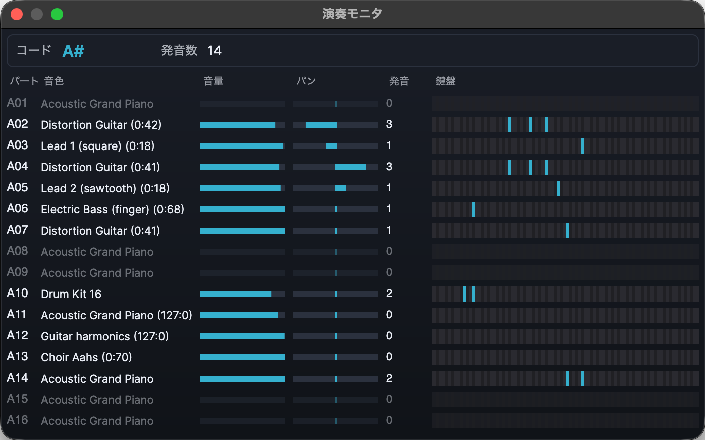

# Glosa

English | [日本語](README.ja.md)

A MIDI player that tells which sound module each song was written for (its target module) and switches port maps to suit it.  
It also emulates one module on another, using TMIDI Player's definition files.



## Features

### What it does

- **Plays the common file formats**
  - Standard MIDI Files (`.mid` `.midi` `.rmi`)
  - Recomposer files (`.rcp` `.r36` `.g18` `.g36`)
  - Songs inside ZIP and LZH archives, played as they are, without unpacking
- **Target module detection** — Tells which module a song was written for (its target module) from the file name, song title, folder path and attached text.
  Which of these are used, and in what order, is chosen in Preferences. When the names give no answer, the song's MIDI data is looked at too.
- **Port maps** — Connects a different MIDI device to each of the six outputs, ports A to F.
  Several arrangements can be kept under their own names, and switched automatically to suit each song's target module.
- **Automatic tone map switching** — Plays songs made for older models with that model's tone map.
  - With an SC-88 or later as the output module, songs for the SC-55, SC-88 and so on are played with that model's map.
  - With an MU100 or later as the output module, songs for the MU50, MU80 and MU90 are played with MU Basic.
- **Capital Tone Fallback (CTF)** — On the SC-55mkII and later Sound Canvas models, plays tones the model lacks with a close tone, as the SC-55 does.
- **LCD panel** — Reproduces the module's LCD (16 characters × 2 lines of text and a 16 × 16 dot picture).
  When no picture is shown, it becomes a level meter.
- **Monitor** — Shows each part's tone name, volume, pan, keyboard and chord name.
- **Tabbed playlists** — Several playlists can be open in tabs.
- Seeking, the keyboard's media keys, and starting playback when files are dropped or opened from a file manager.

### What a TMIDI definition file adds

Load TMIDI Player's definition file, and the same **module emulation** as TMIDI Player's becomes available.
A song written for a different module is played with the differences converted (a song for the SC-88Pro played on an MU2000, for example).

- **Conversion during playback** — For each pair of target module and output module, the song is rewritten by the definition file's rules.
  Tones are replaced with ones the output module has, and exclusive messages it does not accept are held back.
- **More output modules to choose from** — Modules only the definition file knows (SYG20, MSGS and others) can be chosen too.
- **Detection by TMIDI Player's rules** — Preferences can switch target module detection to the definition file's rules.



## Requirements

- Windows 10 (1607 or later) or Windows 11, macOS 14 or later, or Linux (x64 or Arm64; Ubuntu 22.04, Debian 12, Fedora 42, RHEL 8 or later, and the like)
- A MIDI output device (an external MIDI module, a software synthesizer or a virtual MIDI port)
  - On Windows, virtual MIDI ports such as loopMIDI can be used.
  - On macOS, the IAC Driver in Audio MIDI Setup and the virtual ports software synthesizers create can be used.
  - On Linux, ALSA sequencer ports can be used (USB MIDI devices, ports software synthesizers create, and Midi Through).

No .NET runtime is needed (the release carries its own).

## Installing and uninstalling

The releases are on the GitHub releases page.

- **Windows** — Unpack `glosa-<version>-win-x64.zip` (`win-arm64` for ARM) anywhere you like, and run `glosa.exe` inside.
  Running `install.cmd` inside puts Glosa in the Start menu, and lets Glosa be chosen under "Open with" for MIDI and RCP files.
  The program stays where it is; only the registrations are made (no administrator rights are needed). If you move the folder, run `install.cmd` again.
  To uninstall, remove the registrations with `uninstall.cmd`, then delete the folder.
  - As it is not signed, the first time it is run Windows says it protected your PC. Press **More info**, then **Run anyway**. If `install.cmd` shows a security warning, press **Run** there too. Ticking "Unblock" in the zip file's properties before unpacking it keeps both from appearing.
- **macOS** — Unpack `glosa-<version>-osx-arm64.zip` (`osx-x64` for Intel Macs) and put `Glosa.app` in the Applications folder.
  To uninstall, move `Glosa.app` to the Trash.
  - The first time it is opened, macOS says it cannot be opened. Press "Open Anyway" under **System Settings → Privacy & Security**, and it opens normally from then on.
- **Linux** — Unpack `glosa-<version>-linux-x64.tar.gz` (`linux-arm64` for ARM) anywhere you like, and run `install.sh` inside from a terminal.
  Answer `y` when it asks, and Glosa appears in the application list, and MIDI files and others can be opened with Glosa from a file manager.
  Run without a terminal, it cannot be answered, and nothing is registered.
  If you move the folder, run `install.sh` again.
  To uninstall, remove the registrations with `uninstall.sh`, then delete the folder.

## Usage

### Choosing the outputs

In **Settings → Port Map Settings...**, assign MIDI devices to ports A to F.

- For **Module**, choose the model of the module connected at the other end of that port (the output module).
  It is used for emulation and for the reset sent before each song.
- Ports with **Reset** checked are sent the output module's reset (GS Reset, XG System On and so on) before each song.
- Turn on **Distribute parts over other ports, 16 each** when each port leads to its own 16-part module.
  Messages for the 32 parts of an SC-88 or SC-88Pro, or for XG parts 17 and up, are then sent to the module on the port that plays that part.
  Leave it off when the ports lead to the two inputs of a real SC-88 or SC-88Pro.
- Several **port maps** can be made. Making one for each set of equipment is handy.
  - The top map is the default map. It cannot be deleted, and songs no other map fits are played with it.
  - Add **Target Modules** to a map, and songs for those modules are played with that map.

Which map is used is chosen in **Settings → Port Map**. "Auto" picks one for each song from its target module; choosing a map fixes it to that map.



### Adding and playing songs

- Add songs from the **File** menu or by dropping them on the window. Adding an archive or a folder adds all the songs in it.
- Double-click a song to start playing from it.
- The play order and repeat are chosen in the **Settings** menu.
- The keyboard's media keys work too.

### Playlists

- Several playlists can be open in tabs. Right-click a tab or a song for what can be done with it.
- Playlist files kept elsewhere are opened with **File → Open Playlist...**.

### Target modules

The playlist shows which module each song is for.

- Values **in parentheses** (such as `(SC-88PRO)`) were detected automatically.
- Songs whose files have not been read yet are left blank. The value appears once the song is played, or with **Look up song lengths and target modules in advance** turned on in Preferences.
- When the detection is wrong, select the song and set it from **Target Module** in the right-click menu.

The detection rules are written in `define.yaml`. To adjust them, rename `define.override.yaml.sample` in the settings folder (**Settings → Open Settings Folder**) to `define.override.yaml` and edit it; Glosa then reads it in place of `define.yaml`. Leave `define.yaml` itself as it is, since each release replaces it.
How to write them is in [define.md](src/Glosa.App/docs/define.md), in the `docs` folder.

### TMIDI definition files

Load a TMIDI definition file with **Settings → Open TMIDI Definition File...**.
TMIDI definition files are not included with this software. Use one exported from TMIDI Player.

### The window

- **Window → Monitor...** shows the state of each part.
- **Window → Debug...** records messages, such as files that could not be read.



### Preferences

Change them in **Settings → Preferences...**. Changes take effect at once or from the next song (only the language and how the screen is drawn wait until the next start).

## Command line

Paths of songs or folders given on the command line are added to the playlist being shown.
As with dropping, if nothing is playing or paused, playback starts from the first song added.

Only one Glosa runs at a time.
If one is already running, a newly started Glosa hands the paths and options it received to the running one and exits at once, and the running Glosa's window comes to the front.
A Glosa given its own settings folder with `--config` counts as a separate one and can run at the same time.

```
glosa [options] [songs or folders...]
```

| Option | Meaning |
|---|---|
| `--def <file>` | Load a TMIDI definition file |
| `--use <module>` | Output module. Kept in the settings |
| `--target <module>` | Target module, given to the songs on the same command line |
| `--device <number or part of the name>` | Output device on port A, of the port map chosen by hand or else the default one. Kept in the settings |
| `--config <folder>` | Folder for the settings and playlists |

## Where settings are kept

Settings and playlists are kept in the folder below. **Settings → Open Settings Folder** opens it.

```
Windows  %APPDATA%\glosa\
macOS    ~/Library/Application Support/glosa/
Linux    ~/.config/glosa/
```

- `settings.yaml` — settings
- `playlists\*.yaml` — playlists (one file each)

When started with `--config`, that folder is used instead.

## For developers

How to build is in [DEVELOPMENT.md](DEVELOPMENT.md), and the design decisions are in [IMPLEMENTATION.md](IMPLEMENTATION.md) (in Japanese).

## License

Glosa is released under the MIT License ([LICENSE](LICENSE)).

The licenses of the third-party software and data Glosa uses are in [THIRD_PARTY_NOTICES.md](THIRD_PARTY_NOTICES.md).
The releases carry the same file and a `licenses` folder as well.
